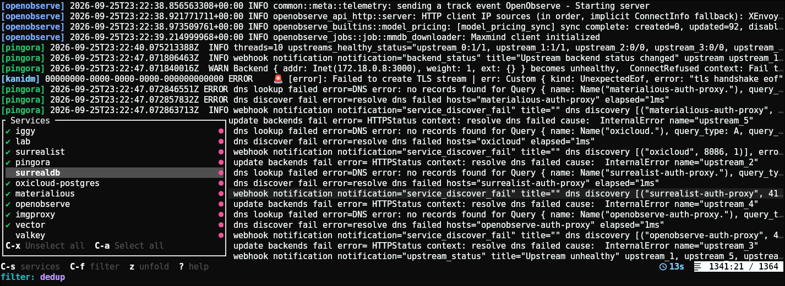

# ocklog


[](https://github.com/emilien-jegou/ocklog)
[](https://deps.rs/crate/ocklog/latest)

**ocklog** is a fast, terminal-based log viewer for Docker containers featuring Vim keybindings, chronological multi-stream aggregation, and an expressive pipeline query language.


---

## Features

* ⚡ Logs all your local containers with automatic stream re-attachment across crash-loops.
* ⏱️ Unifies multiple live and historical streams into a single timeline.
* 🔍 Filter logs using our intuitive query language and view changes as you type.
* ⌨️ **Vim Navigation** vim style navigation and clipboard support
* 📦 **Services Switcher** turn services on/off without leaving the ui.
* 🎨 **Always beautiful** themed derived from your terminal ANSI colors

---

## 📦 Installation

### Cargo

```sh
cargo install ocklog
```

### Nix Flakes

```nix
inputs.ocklog.url = "github:emilien-jegou/ocklog";
```

```nix
environment.systemPackages = [ inputs.ocklog.packages.${pkgs.system}.default ];
```

---

## 🔍 Query Language (QL)

Queries chain matchers, boolean expressions, and stream modifiers using pipes (`|`).

```text
"error" or 'warn' | not `tls` | dedup | since 5m
```

### Matchers & Quotes

Strings can use double quotes (`""`), single quotes (`''`), or backticks (`` ``) interchangeably with escape support (`\'`, `\"`, `` \` ``). Unquoted search terms are flagged as syntax errors.

| Syntax | Matching Rule |
| :--- | :--- |
| `"term"` / `'term'` / `` `term` `` | Case-insensitive literal |
| `s"term"` / `s'term'` / `` s`term` `` | Case-sensitive literal |
| `~"pattern*"` / `~'pattern*'` | Case-insensitive glob (`*`, `?`) |
| `s~"pattern*"` / `s~'pattern*'` | Case-sensitive glob (`*`, `?`) |
| `r"pattern\d+"` / `r'pattern\d+'` | Case-insensitive regex |
| `sr"pattern\d+"` / `sr'pattern\d+'` | Case-sensitive regex |

### Boolean Logic

Standard precedence (`not` > `and` > `or`) with grouping parentheses:

```text
"error" and not "timeout"
("error" or 'warn') and not (`healthcheck` or `probe`)
```

### Pipeline Modifiers (`|`)

* **Filters & Exclusions:** `| not "noisy message"`
* **Time Boundaries:**
  * `| since 5m` (logs from the last 5 minutes; supports `s`, `m`, `h`, `d`)
  * `| before 1h` (logs older than 1 hour ago)
* **Surrounding Context:**
  * `| context 3` (3 lines before and after matches)
  * `| context 3 10` (3 before, 10 after)
  * `| before 5` (5 lines before matches)
  * `| after 10` (10 lines after matches)
* **Limits:**
  * `| first 20` (first 20 lines)
  * `| last 50` (last 50 lines)
* **Deduplication:**
  * `| dedup` (merges adjacent identical lines with a count badge `2x — `)
  * `| dedup all` (merges identical lines stream-wide)
  * `| dedup 5m` (merges duplicates within a 5-minute rolling window)

---

## ⌨️ Navigation & Keybindings

### Normal Mode

| Keybinding | Action |
| :--- | :--- |
| `j` / `k` (or `↓`/`↑`) | Move down / up 1 line |
| `h` / `l` (or `←`/`→`) | Move left / right 1 character |
| `w` / `b` / `e` | Jump forward / backward / end of word |
| `0` / `$` | Jump to start / end of line content |
| `<C-j>` / `<C-k>` | Jump down / up 5 lines |
| `<C-h>` / `<C-l>` | Jump left / right 5 characters |
| `<C-d>` / `<C-u>` | Half-page down / up |
| `gg` / `G` | Jump to top / bottom of buffer |
| `z` | Toggle Line Fold Mode (folded single-line vs unfolded wrap) |
| `<C-s>` | Toggle Service Switcher menu |
| `<C-f>` | Toggle Filter command line |
| `q` | Quit |

### Visual Selection & Copying

| Keybinding | Action |
| :--- | :--- |
| `v` | Character visual mode |
| `V` | Line visual mode |
| `<C-v>` | Block visual mode (constrained to log content) |
| `y` | Copy selection to system clipboard |
| `Mouse Drag` | Drag to select (dragging from a tag selects full lines); copies on release |
| `Esc` / `<C-c>` | Cancel selection / close popups |

### Filter Command Line (`<C-f>`)

| Keybinding | Action |
| :--- | :--- |
| `←` / `→` | Move cursor inside query |
| `Home` / `End` (or `<C-a>`/`<C-e>`) | Jump to start / end of query |
| `Backspace` / `Delete` | Delete character before / under cursor |
| `<C-w>` / `<C-u>` | Delete word backward / clear input |
| `Enter` | Apply query |
| `Esc` / `<C-f>` | Cancel and dismiss prompt |

---

---

## ⚙️ CLI Options

```sh
# Enable debug file logging
ocklog --log-enable --log-save-path /tmp/ocklog.log

# Generate a profiling flamegraph
ocklog --flamegraph-enable --flamegraph-save-file /tmp/ocklog.folded
```

---

## 🙏 Credits

* [Ratatui](https://github.com/ratatui/ratatui) & [Crossterm](https://github.com/crossterm-rs/crossterm)
```
